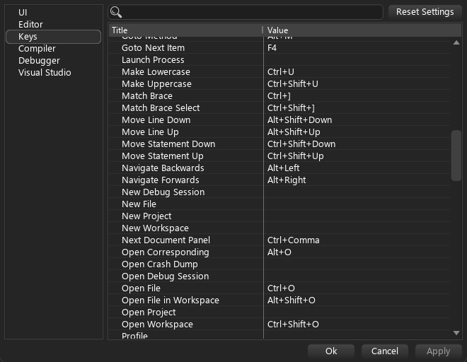

# Simply Dark
Custom Beef IDE theme

# Works only with latest nightly build of IDE!

# Installation
1. Just download zip from Releases page
2. Unzip it and copy it to `C:\Program Files\BeefLang\bin\themes` (create folder `themes` if its needed)
3. Write theme name in theme settings
    

4. Hit Apply button
5. Profit